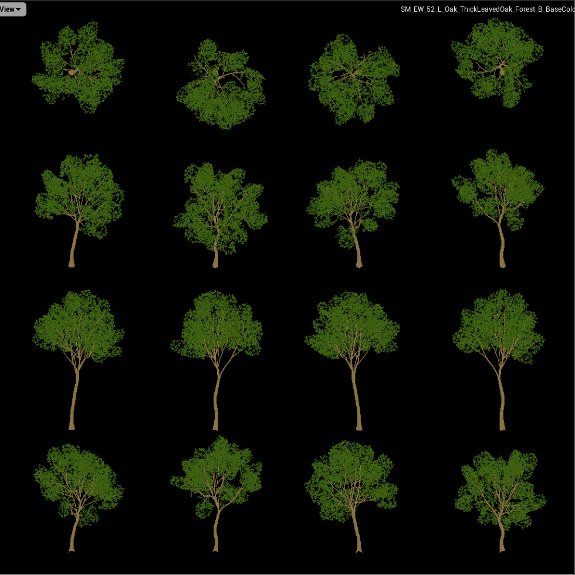
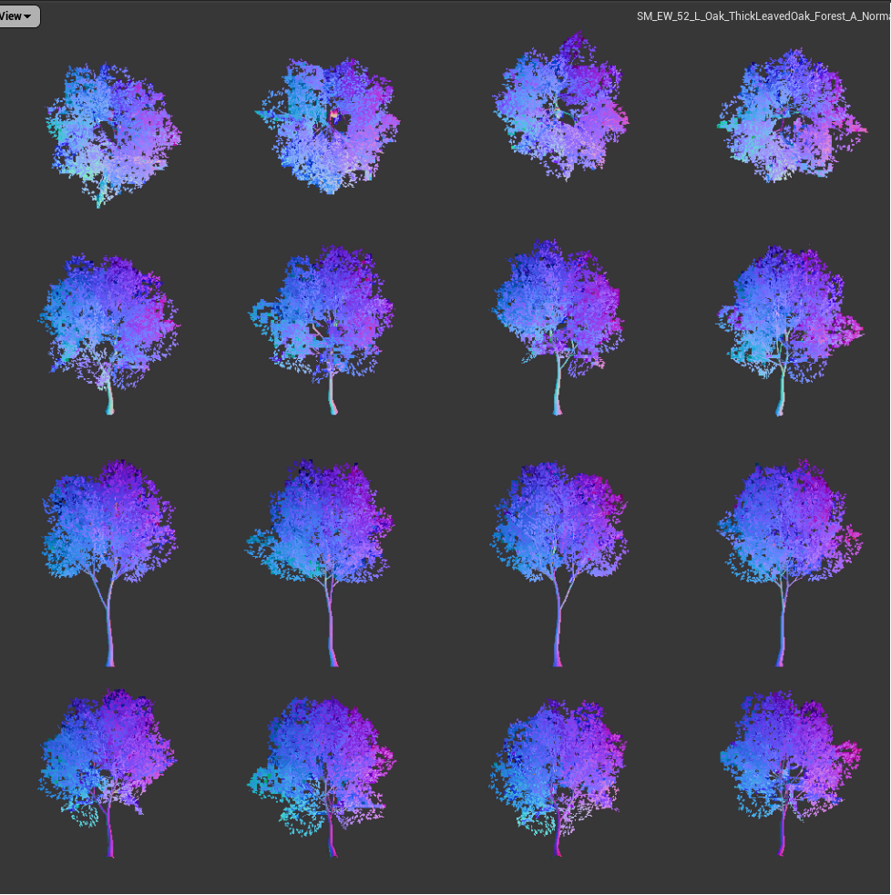
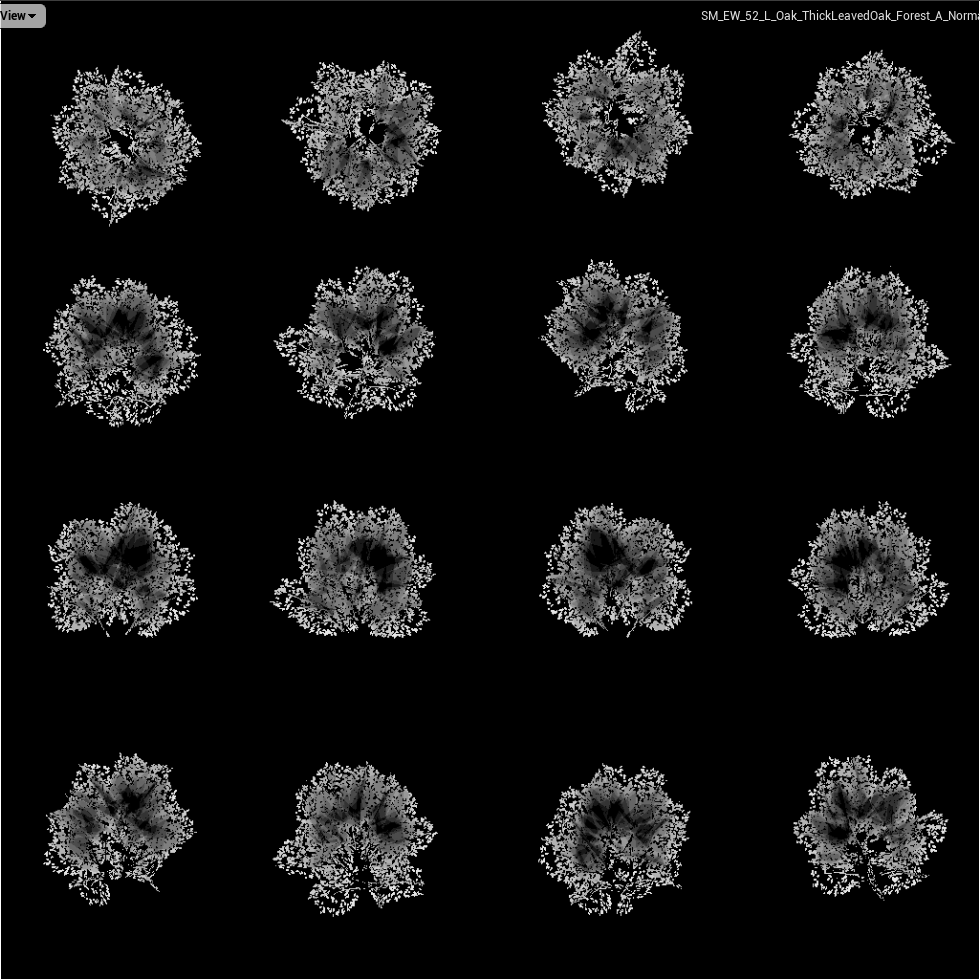

#48 大世界的场景复杂度管理方案
===

- 作者: 天美 tianpeng
- 文章分类: 游戏客户端架构和技术

 
&emsp;&emsp;大世界，首当其冲的三个问题：规模、复杂度/性能、渲染，分别对应内容生产、内容承载和内容呈现。本文聚焦如何解决内容承载问题，即场景复杂度管理。在大世界场景里，通常有大面积地形，大规模植被，大量琐碎静态物件等，在相同的硬件平台下，复杂度管理模块很大程度上决定了场景里填充内容的数量和质量。
&emsp;&emsp;本文描述的大世界场景复杂度管理模块，基于控制理论里的负反馈系统，分为三个部分： 
1、输入部分。包含复杂度降维，复杂度度量，Bucket计算。在引擎和Gameplay层面，根据游戏定制计算因子和权重，统一计算复杂度和Bucket，传递给控制器模块。 
2、控制器/被控对象部分。包含Visibility检测，LOD系统，Scalability系统，动态分辨率等。该部分根据输入和反馈信号，利用多种不同的复杂度控制算法综合调节系统当前负荷。 
3、输出/反馈部分。用于实现Adaptive Performance。根据系统负荷能力，系统当前负荷以及系统指定负荷，传递反馈信号到控制器模块。
&emsp;&emsp;整个系统，最终可以达成如下几个目标： 
1、离线检测工具，自动分析场景各区域复杂度，帮助设计人员更有效的设计场景内容。 
2、运行时根据平台设定，智能控制场景内容的加载卸载、显示隐藏、LOD控制等。 
3、根据平台负载能力和当前负荷，更有效的控制运行负荷，获取平滑的fps。 
 
 

# 1.概述
&emsp;&emsp;随着硬件平台和游戏技术的不断进步，呈现到玩家手上的游戏品质也在快速提升，尤其是随着手游市场的崛起，近年来呈现了一批品质拔尖的作品。即便这样，依然无法满足玩家对于3A游戏的期待。3A游戏，大部分都是以大世界的形式来表现游戏内容。即便硬件平台的能力在飞速提升，往往也很难满足大世界场景复杂度的爆发式增长。所以如何控制和调节场景复杂度，在很大程度上决定了场景里填充内容的数量和质量。
&emsp;&emsp;场景复杂度，从广义上讲，就是有场景对象的数量和内容细节决定。更细化一点，每个对象的内容包括Mesh，纹理，材质等核心要素。
&emsp;&emsp;控制场景复杂度，最终的目标就是要让游戏平滑的运行，并尽量保持低功耗。要达到这样的目的，就要从场景对象消耗的CPU、GPU、内存方面入手。即控制显示哪些对象，对象的加载与卸载，显示与隐藏，对象的质量(LOD)等。

## 1.1 系统框架
&emsp;&emsp;如何把这些控制手段整合到一个稳健、智能的控制系统里，是我们这里要考虑的内容。
&emsp;&emsp;在工业控制理论里，有两种常用的控制系统模型：正反馈和负反馈。若反馈信号与输入信号极性相同或变化方向同相，则两种信号混合的结果将使放大器的净输入信号大于输出信号，这种反馈叫正反馈。正反馈主要用于信号产生电路。反之，反馈信号与输入信号极性相反或变化方向相反（反相），则叠加的结果将使净输入信号减弱，这种反馈叫负反馈放大电路和自动控制系统通常采用负反馈技术以稳定系统的工作状态。
&emsp;&emsp;很显然，我们的目标是在任意平台任意场景下，达到一个稳定的FPS输出，所以我们需要采用负反馈控制系统模型。

## 1.2 系统模块

# 2.输入模块

## 2.1 复杂度评估

## 2.2 Budget计算与分配

 

## 2.3 特殊对象的处理
### 2.3.1 Landscape 
低模代理

### 2.3.2 Foliage 
Imposter

# 3.控制器/被控对象模块

## 3.1 场景对象选择
## 3.2 场景对象加载与卸载
## 3.3 Visibility检测
## 3.4 场景对象显示与隐藏
## 3.5 LOD策略
## 3.5 其他调节策略

# 4.输出/反馈模块
## 4.1 输出数据采集

## 4.2 反馈数据采集

## 4.3 反馈控制器算法
~~~
enum EPerformanceWarningLevel
{
	NoWarning,
	ThrottlingImminent,
	Throttling,
}

enum EPerformanceBottleneckType
{
	CPU
	GPU,
	Memory,
	TargetFrameRate,
};

/**
 * 
 */
class NGR_API FPerformanceController
{
public:
	FPerformanceController();
	~FPerformanceController();

	bool PreferRaiseLevels();
	bool CanLowerLOD();

	void RaiseGPULevel();
	void LowerGPULevel();
	void RaiseCPULevel();
	void LowerCPULevel();

	void RaiseLOD();
	void LowerLOD();

protected:
	int cpuLevel;
	int gpuLevel;

	int maxCPULevel;
	int maxGPULevel;
};
~~~

# 5.总结
