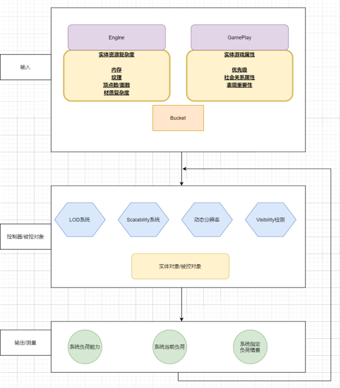

#48 大世界的场景复杂度管理方案
===

- 作者: 天美 tianpeng
- 文章分类: 游戏客户端架构和技术

 
&emsp;&emsp;大世界，首当其冲的三个问题：规模、复杂度/性能、渲染，分别对应内容生产、内容承载和内容呈现。本文聚焦如何解决内容承载问题，即场景复杂度管理。在大世界场景里，通常有大面积地形，大规模植被，大量琐碎静态物件等，在相同的硬件平台下，复杂度管理模块很大程度上决定了场景里填充内容的数量和质量。
本文描述的大世界场景复杂度管理模块，基于控制理论里的负反馈系统，分为三个部分： 
1、输入部分。包含复杂度降维，复杂度度量，Bucket计算。在引擎和Gameplay层面，根据游戏定制计算因子和权重，统一计算复杂度和Bucket，传递给控制器模块。 
2、控制器/被控对象部分。包含Visibility检测，LOD系统，Scalability系统，动态分辨率等。该部分根据输入和反馈信号，利用多种不同的复杂度控制算法综合调节系统当前负荷。 
3、输出/反馈部分。用于实现Adaptive Performance。根据系统负荷能力，系统当前负荷以及系统指定负荷，传递反馈信号到控制器模块。
&emsp;&emsp;整个系统，最终可以达成如下几个目标： 
1、离线检测工具，自动分析场景各区域复杂度，帮助设计人员更有效的设计场景内容。 
2、运行时根据平台设定，智能控制场景内容的加载卸载、显示隐藏、LOD控制等。 
3、根据平台负载能力和当前负荷，更有效的控制运行负荷，获取平滑的fps。 
 
 

# 1.输入部分

~~~
int32 UMaterialExpressionLandscapeSortBasedLayerBlend::Compile(FMaterialCompiler* Compiler, int32 OutputIndex)
{
	struct LayerWeightData
	{
		int32 Index;
		FName LayerName;
		int32 WeightCode;
	};
}
~~~
 

# 2.控制器/被控对象部分

# 3.输出/反馈部分
