#48 大世界的场景复杂度管理方案
===

- 作者: 天美 tianpeng
- 文章分类: 游戏客户端架构和技术
 
&emsp;&emsp;大世界，首当其冲的三个问题：规模、复杂度/性能、渲染，分别对应内容生产、内容承载和内容呈现。本文聚焦如何解决内容承载问题，即场景复杂度管理。在大世界场景里，通常有大面积地形，大规模植被，大量琐碎静态物件等，在相同的硬件平台下，复杂度管理方案很大程度上决定了场景里填充内容的数量和质量。 
&emsp;&emsp;本文描述的大世界场景复杂度管理方案，基于控制理论里的负反馈控制系统，分为三个部分： 
1、输入部分。包含复杂度降维，复杂度度量，对象评分计算。在引擎和Gameplay层面，根据游戏定制计算因子和权重，统一计算复杂度和评分，传递给控制器模块。 
2、控制器/被控对象部分。包含Visibility检测，LOD系统，Scalability系统，动态分辨率等。该部分根据输入和反馈信号，利用多种不同的复杂度控制算法综合调节系统当前负荷。 
3、输出/反馈部分。用于实现Adaptive Performance。根据系统负荷能力，系统当前负荷以及系统指定负荷，传递反馈信号到控制器模块。
&emsp;&emsp;整个系统，最终可以达成如下几个目标： 
1、运行时根据平台设定，智能控制场景内容的加载卸载、显示隐藏、LOD控制等。 
2、根据平台负载能力和当前负荷，更有效的控制运行负荷，获取平滑的fps。 
 
[审稿意见:@keloy week1] 
--建议在背景描述中将该篇文章适应的范围说明下，对于移动端的功耗发热特殊说明，该篇文章是多种平台都适用的，另外后面多处提到的据之前的项目经验其实没有必要--

# 1.概述
&emsp;&emsp;随着硬件平台和游戏技术的不断进步，呈现到玩家手上的游戏品质也在快速提升，尤其是随着手游市场的崛起，近年来呈现了一批品质拔尖的作品。即便这样，依然无法满足玩家对于3A游戏的期待。3A游戏，大部分都是以大世界的形式来表现游戏内容。虽然硬件平台的能力在飞速提升，往往也很难满足大世界场景复杂度的爆发式增长。所以如何控制和调节场景复杂度，在很大程度上决定了场景里填充内容的数量和质量。 
&emsp;&emsp;下图是一个典型的大世界场景，可以清楚看到，其显著的特征有，视野宽，视距远，地图大，植被多，风格特征变化快，从而导致绘制内容的种类比较多，资源的使用比传统小场景游戏要更为复杂。
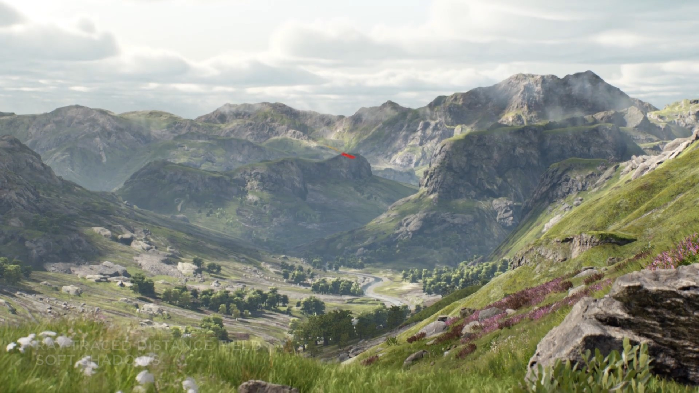
[审稿意见:@keloy week1]  --这里需要有图片名称，另外这张图可以用自己项目或者demo的截图，质量选择高一点能代表复杂度较高的场景截图更好--
 

&emsp;&emsp;为简化我们的算法模型、以及篇幅限制等原因，文中并不会考虑渲染管线、光照、后处理等一些高级渲染话题，因为这些技术的使用，大多都可以根据硬件平台能力和玩家喜好，通过渲染选项进行静态配置。所以文中关于复杂度和控制算法的讨论，都是基于简化后的基础模型特性进行阐述和讨论。 
&emsp;&emsp;场景复杂度，从广义上讲，就是由场景对象的数量和内容细节决定。具体来讲，每个对象的内容通常包括网格(Mesh)，纹理，材质等核心要素。 
&emsp;&emsp;控制场景复杂度，最终的目标就是要让游戏在保证一定画质得前提下，能够平滑的运行，并尽量保持低功耗。要达到这样的目的，就要从场景对象消耗的CPU、GPU、内存、带宽方面入手。即控制显示哪些对象，对象的加载与卸载，显示与隐藏，对象的质量(LOD)等。 
&emsp;&emsp;通常，我们往往会使用可视性(Visibility)检测算法、LOD策略等，来简单决定场景物件的显示和显示质量，但没有一个很好的衡量标准动态实时的检测和反馈这些算法的有效性和准确性。更没有把这些复杂度控制方法整合到一个统一的系统里面，并通过系统的实际运行数据，来准确或者相对准确的来决定我们使用何种控制手段以及如何控制场景复杂度。 
&emsp;&emsp;以上这些，就是我们提出大世界的场景复杂度控制方案的出发点。 
&emsp;&emsp;需要注意的是，本方案在整体思路上可适用于多种平台，但是在某些具体技术点的讨论上会倾向于移动平台。相对于其他平台，移动平台有其特殊性，特别是带宽和功耗发热问题。移动平台普遍采用soc(System on a Chip)架构，芯片面积小，散热能力有限，容易引起发热降频问题，cpu、gpu共用系统内存，导致带宽小，传输数据慢，并且是功耗的主要来源。下图是高通针对移动平台游戏的一份功耗测试数据：
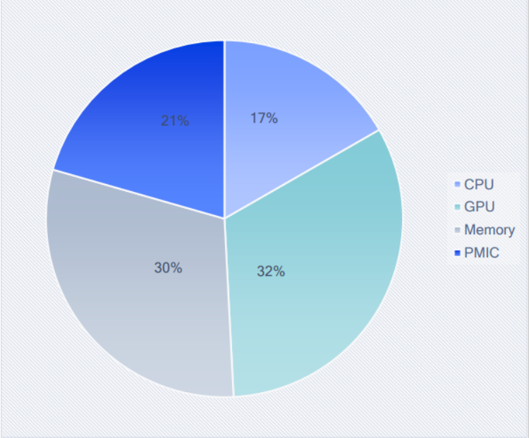

## 1.1 渲染框架
&emsp;&emsp;从游戏运行层面看，硬件平台的核心资源包括：cpu，gpu，内存、带宽（这里特指soc架构的移动平台的共享显存）。 
&emsp;&emsp;现代硬件平台和图形API，总的趋势是并行渲染。例如，相对于传统图形API，Vulkan一个显著特点就是对多线程友好，下图是Nvidia的关于vulkan多线程的工作原理图：
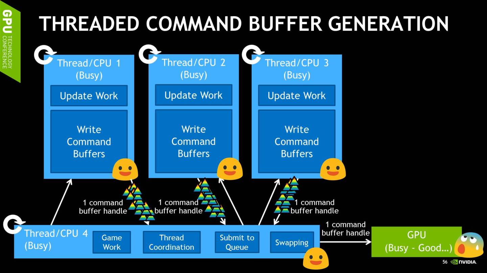
&emsp;&emsp;Unreal Engine(后面简称UE)引擎本身是一个跨平台3D引擎，封装了数种流行图形API，并能运行在不同的硬件平台上。同时，充分采用了并行的优势，实现了一套多线程渲染框架。如下图所示：
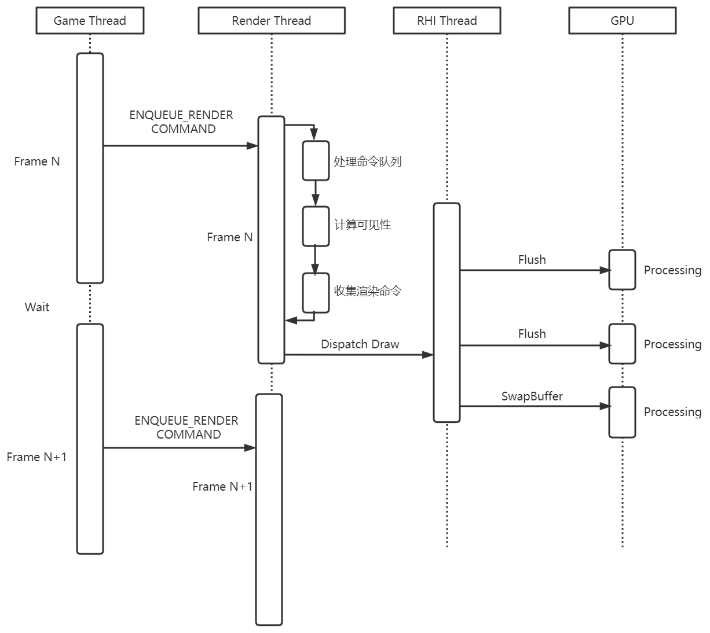
&emsp;&emsp;整个UE引擎的框架，大致可分为： 
game thread, 负责游戏逻辑，提交cpu渲染数据。 
renderer thread，负责排序、剔除、生成渲染命令。 
rhi thread，负责生成gpu渲染数据，提交渲染命令。 
gpu thread，负责执行渲染命令。 
&emsp;&emsp;根据这四个线程的功能，他们也构成了UE的手游客户端的性能的几个主要部分：CPU逻辑，CPU渲染，CPU提交渲染命令，GPU渲染。除此之外，内存和带宽也是两个重要的性能点。本方案便是立足于优化这些性能点。

## 1.2 系统框架
[审稿意见:@keloy week1] --系统框架的描述不够清晰，建议自描述类型的用语-- 
&emsp;&emsp;在自动控制理论中，有两种常用的控制系统模型：正反馈和负反馈。正反馈，反馈信号与输入信号同向，用于增强输出与输入的偏差；负反馈，反馈信号与输入信号反向，用于抑制输出与输入的偏差。在实际应用中，负反馈系统通常用于搭建稳定闭环的自动控制系统。一个典型的负反馈控制系统如下图： 
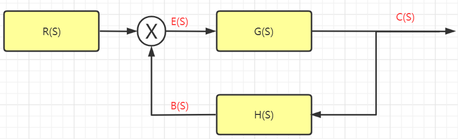
&emsp;&emsp;结合我们方案的目标，即在任意平台任意场景下，根据系统的输入和期望输出，自动调节输入内容，达到稳定的FPS输出，我们设计出如下的基于负反馈模型的场景复杂度控制系统：
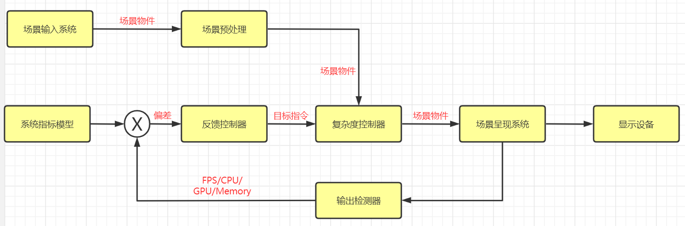
&emsp;&emsp;整个系统分为三个部分： 
输入部分： 
场景输入模块，主要指的是场景对象的加载和序列化，生成CPU渲染数据等。 
系统指标模块，主要指的是根据硬件平台，以及玩家的设置，预先指定的游戏运行时的系统指标，包括FPS，显示特性，CPU、GPU、内存、带宽、电量消耗等数据。 
输出部分： 
场景呈现模块，主要指渲染模块。 
输出检测模块，主要指实际游戏运行时的系统指标，包括FPS、CPU、GPU、内存、带宽、电量消耗等数据。 
反馈控制部分： 
场景预处理模块，主要指对于场景对象的预处理，用于场景复杂度降维，把全场景复杂度降至当前视野复杂度，主要是指Visibility检测算法。 
反馈控制器模块，主要用于根据反馈的系统指标数据和期望的系统指标数据之间的差异，根据一定的策略发送控制指令到复杂度控制模块。 
复杂度控制器模块，根据接收到的控制指令，进行相应操作，如加载卸载对象、显示隐藏对象、调节LOD等。 
[审稿意见:@keloy week1] 
--改段内容比较关键，要将各个模块功能以及结合上面提到的4个线程说明重要模块工作在什么线程，时许图的对应关系-- 
&emsp;&emsp;根据上文讨论的现代引擎普遍采用的多线程渲染框架结构，我们的复杂度控制系统可以很好的与之适配。首先，由工作在game thread的场景输入模块，负责加载场景对象，并生成渲染数据提交给renderer thread。然后由隶属于renderer thread的场景预处理模块，负责执行数据的可视性检测功能。之后由场景呈现模块，负责渲染命令的生成、提交、执行多个职能，分别工作在renderer thread、rhi thread和GPU thread中。而输出检测模块，跨度最广，负责各个线程以及线程中某些子过程的数据数据检测，并把数据反馈给全局对象反馈控制器模块，它和复杂度控制器模块以及系统指标模块，可以根据实际情况，工作于game thread或者独立的线程，最终把控制指令通过命令的形式由任务系统发送给其他线程，其他线程从任务队列中不断获取命令并执行。

# 2.输入部分
&emsp;&emsp;场景的复杂度，是场景中所有对象复杂度的总和。关于复杂度的定义，根据之前渲染架构一节对于硬件平台的核心资源分析，我们把对于核心资源消耗的因素，统一称作复杂度要素。为了简化模型和算法原型，我们这里关注的场景对象的复杂度，主要由网格(Mesh)，纹理，材质等核心要素决定。在确定物件的物理复杂度之后，我们还要根据物件的距离(Distance)、屏幕占比(ScreenSize)、视觉重要性(根据需要人为定义，比如重要性、关注度等)等因素，并根据预先设计的因子权重系数，计算出对象的评分(Ticket)，这个数据将用于后面控制模块的复杂度控制算法中。 

## 2.1 对象复杂度评估
&emsp;&emsp;本方案，对于复杂度的评估，基于简化后的模型，主要包含网格(Mesh)，纹理，材质三个要素。这三个要素在烘焙特定平台资源的时候可以得到。其中： 
Mesh，主要影响加载时长，内存占用，带宽消耗，以及GPU的ALU计算量。 
纹理，主要影响带宽。 
材质，主要影响GPU消耗。 
对于多级LOD Mesh，我们都会赋予每级LOD独立的Mesh、纹理和材质，针对每级LOD计算一个复杂度。计算公式如下： 
[审稿意见:@keloy] --公式编写不标准-- 
$$ c = \Sigma\sigma_{i} c_{i} $$
$$ c_{i} = g(x) $$
&emsp;&emsp;其中c为总的复杂度，$ c_{i} $为某个复杂度因子算出的复杂度，$ g(x) $为某个复杂度因子的评估函数，$ sigma_{i} $为某个复杂度因子的权重系数，不同因子的权重系数可以根据硬件平台进行定制。我们这里选择把不同因子的复杂度整合为一个总的数值，是为了方便计算后面的对象评分和总的场景复杂度。不同项目也可以根据实际需要将不同因子的复杂度作为独立项单独存储。

## 2.2 对象评分(Ticket)计算
[审稿意见:@keloy week1] --场景对象社交属性太生僻，建议用场景对象视觉重要性-- 
&emsp;&emsp;通常，我们会在GamePlay层面根据场景对象的视觉重要性（比如重要性、关注度等）调整对象的LOD、显示或隐藏，在Engine层面又会根据对象的物理属性（比如Distance、ScreenSize）再次调节对象的LOD、显示或隐藏。这种做法因为数据和控制时机的割裂，常常造成很奇怪的bug，或者调节效果不理想。所以，在本方案中，我们会根据预先设定的因子和因子权重，统一计算对象评分。然后存储在一个管理对象评分的全局对象Ticket Manager中，并按大小排序，之后用于复杂度控制器中，智能调节对象LOD，显示隐藏，加载卸载等。 
&emsp;&emsp;下图可以直观的理解这个概念： 
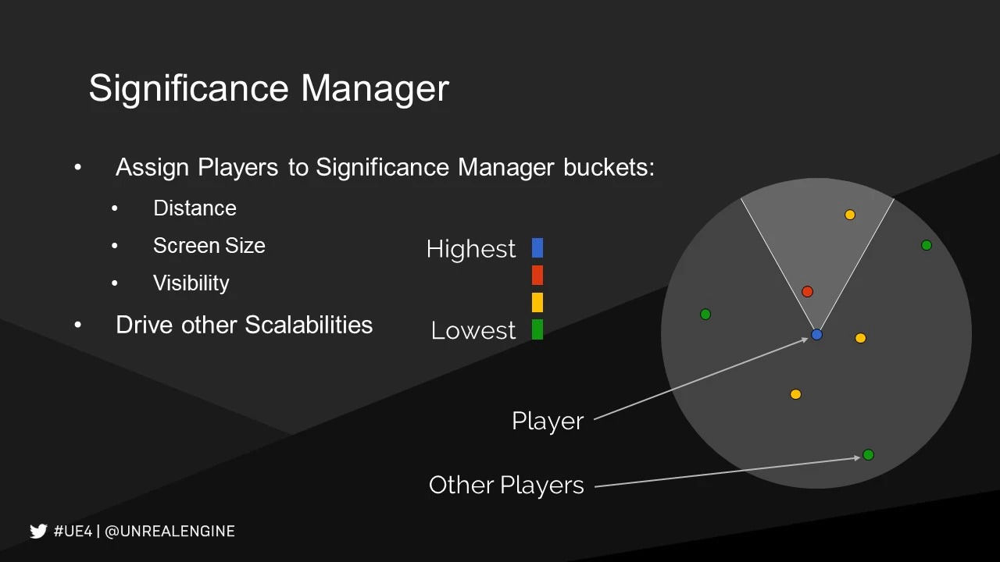
 
&emsp;&emsp;本方案的对象评分计算公式如下： 
[审稿意见:@keloy week1] --公式问题-- 
$$ T = \Sigma\omega_{i} t_{i} $$
$$ t_{i} = f(x) $$
&emsp;&emsp;其中T为对象总的评分，$ t_{i} $为某个因子算出的评分，$ f(x) $为某个因子的评估函数，$ omega_{i} $为某个因子的权重系数。在计算复杂度的评估函数中，我们引入了ScreenSize变量，因为这个变量对于材质复杂度的影响比较大。 
&emsp;&emsp;之所以要采用权重系数，是为了隔离每一项因子进行独立的权重计算（即更方面抽象出评估函数$ f(x) $），并将公式中的每一项因子权重$ t_{i} $进行归一化，再通过$ omega_{i} $ 调节每一项因子所占的权重来确定该因子的重要程度。通过这样的权重系数设计，更方便策划和程序来调试系统的数值和功能。

## 2.3 Bucket分配
&emsp;&emsp;根据硬件平台的能力，我们会制定出不同的预算配置，即Bucket的概念，他指的是为不同重要等级的对象预先分配一个LOD段，根据对象评分，将对象动态移动到某个LOD端。Bucket分配策略需要根据不同的硬件平台能力和当前选取的资源消耗等级进行合理定制。比如性能较差的移动平台，除了自身控制的角色给的Bucket比较高，剩下的角色的都比较低。下图是一个Bucket分配策略示意图：
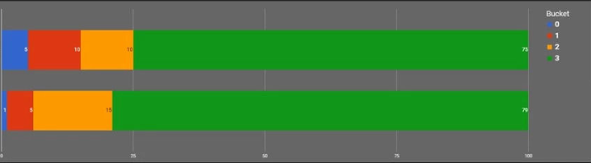

## 2.4 系统指标制定
&emsp;&emsp;我们在开发游戏时，会经常问自己，我的游戏需要占用多少cpu、内存，需要多少帧率(FPS)。总体来说，cpu、内存占用越少越好，FPS越高越好。但又是相对的，比如FPS越高，游戏体验会更加流畅，但也意味着消耗资源更多，电量消耗更快。根据2019年中国移动游戏质量白皮书给出的建议，有如下的参考数据：

&emsp;&emsp;在制定系统指标的数值时，我们需要根据游戏类型和硬件平台的能力，为不同的FPS数值，设置对应的场景复杂度总量、CPU时间、GPU时间、DrawCall数值和Memory数值。反复调试总结，最终形成一个合理的数值配置文件，作为系统指标模块的输入。在此基础上，反馈控制模块会根据当前的系统指标的预期数值和输出检测反馈数值的差值，以及根据当前场景复杂度，系统会自动选一个合适的FPS数值作为目标，并根据CPU时间、GPU时间、DrawCall数值和Memory数值动态调整场景复杂度，以期在目标FPS上稳定运行游戏。
[审稿意见:@keloy week1] --读到这里跳变明显，缺少一节内容来阐述大世界场景复杂度的构成要素，这些场景要素如何计算ticket，下面的这些特殊对象的优化手段出现才会顺理成章--

# 3.输出部分
&emsp;&emsp;输出部分除了最终将场景内容输出给显示设备的渲染模块，还有用于检测系统运行时指标数据的输出检测模块。我们这里关心的指标数据，通常包括FPS、CPU、GPU、内存、带宽、电量消耗等数据。想要精确的获取这些数据，十分依赖硬件平台自身的驱动特性。实际上在大部分情况下，应用层没有办法简单有效的拿到这些系统内核层面的数据。根据我们设计的系统，可以简化问题需求，我们只需要高效并相对准确的获取FPS、CPU和GPU时间、以及内存和带宽数据。
## 3.1 输出检测模块
&emsp;&emsp;UE的Stats系统已经实现了一套性能数据检测机制，可以获取上述数据，具体可以参考UE官方网站的Stats System OverView的内容。本方案采用该机制，获取FPS、DrawCall、CPU时间、GPU时间和Memory数据，作为运行期的反馈数据，和系统指标模块数据进行对比，作为反馈数据输入给反馈控制模块。当然，读者可以根据项目需要，利用和扩展Stats系统，获取Game Thread、Renderer Thread、RHI Thread以及GPU Thread不同阶段下一些具体事件和函数的时间和内存消耗，比如IO加载，计算场景物件可见性，生成GPU Vertex Buffer等，为反馈控制模块提供精细控制策略的数据。

### 3.1.1 Stats系统
&emsp;&emsp;Stats系统基于埋点的机制，即通过在一段逻辑前后显示的增加标签来录得这段时间这个标签内逻辑的运行时间。
&emsp;&emsp;Stats系统有很多种类型的stat，测试cpu运行时间的stat叫做cycle stat。具体可分为如下步骤： 
1、每个stat一定存在于一个stat group里，需要通过下面宏先定义一个stat group，
DECLARE_STAT_GROUP(Description, StatName, StatCategory, InDefaultEnable, InCompileTimeEnable, InSortByName)
这里的InDefaultEnable表示是否默认开启，默认不开启的话需要在运行时通过 stat group enable StatNamel来动态开启。这个宏会定义一个FStatGroup_StatName的结构体。 
2、定义一个cycle stat，通过宏
DECLARE_CYCLE_STAT(CounterName,StatId,GroupId)，这里的groupid就是之前定义的group的statname。这个宏其实是调用一个更加通用类型stat的声明 DECLARE_STAT(Description, StatName, GroupName, StatType, bShouldClearEveryFrame, bCycleStat, MemoryRegion)，它会定义一个FStat__ StatId的结构体，并同时声明一个全局的FThreadSafeStaticStat<FStat__ StatId>变量StatPtr_StatId，这个变量有个主要的作用是高效率的通过getstatid（）接口返回某个给定名字的statid的全局唯一的FStat__ StatId实例。 
3、测量，定义好之后可以在一段代码的作用域开始处加入SCOPE_CYCLE_COUNTER(StatId)，它会为当前作用域的前后埋点，这statid会用来统计这个作用域处的cpu时间开销，其实它获取到全局的这个FStat__StatId用其构造了一个FScopeCycleCounter的临时变量，它继承自FCycleCounter，它是个基于scope的变量，在构造的时候会调用FCycleCounter的start，start就会开始设定这个FStat__ StatId的统计，而析构的时候他调用FCycleCounter的stop来停止收集。

### 3.1.2 Stats数据类型
&emsp;&emsp;Stats系统支持如下数据类型：

### 3.1.3 扩展定制Stats系统
&emsp;&emsp;UE的RHIcommandlist自带了一个函数FRHICommandListImmediate::SetCurrentStat，可以用来让Render给RHI加一个标记，这个标记就可以认为是Render的某个阶段的名字，UE自带了在Render的很多阶段下了这个标记，我们还可以自己补充，这个函数的原理如下：
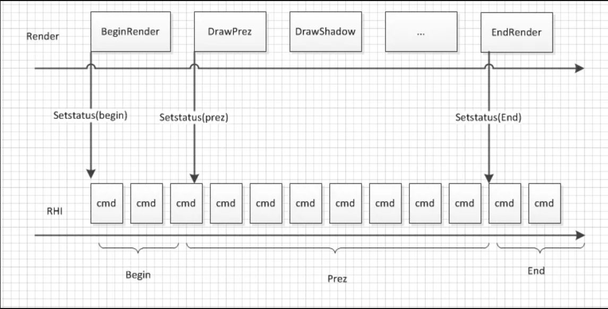
&emsp;&emsp;这个status本身也是以command的形式插入队列，所以每一条RHI执行的cmd会被统计到它之前最近的那个status tag下面，通过不断的细分插入这些tag，我们可以跟踪到RHI的cmd从是在Render的哪个阶段被产生。

# 4.反馈控制部分
&emsp;&emsp;在介绍反馈控制部分的各个模块之前，我们首先明确两个概念：低帧率和卡顿。 
&emsp;&emsp;首先低帧率和卡顿是两种完全不同的瓶颈类型，虽然归根到底都是某个函数执行的过慢引起的，但是定位和解决方法并不一样。低帧率瓶颈是需要统计一段时间内CPU把更多的时钟耗费在了哪些函数上，或统计一段时间内各个函数占用的cpu时间百分比，找到百分比高的将其优化，就会使帧率得到整体的提高。卡顿则是在一帧的一次运行内某段代码的运行产生了比平均情况明显的长时间，需要定义这段代码的起始点，分别进行计时，然后在连续的统计数据中找到峰值。简单来说帧率瓶颈是统计平均的CPU占用，而卡顿是找峰值。 
&emsp;&emsp;需要指出的是，本文提出的场景复杂度控制系统，目标在于改善和优化低帧率问题，能缓解部分加载引起的卡顿问题。

## 4.1 复杂度控制模块
&emsp;&emsp;在游戏运行时，当场景对象确定之后，复杂度控制的本质就是如何在设定的策略和有限的硬件资源条件下，尽可能多的显示更多更好的物件，即在性能和画面之间取得一个较好的平衡。常用的方法包括： 
选取合适的对象lod。 
合理的显示、隐藏对象。 
适当的加载、卸载对象。 
优化drawcall。Drawcall, 直接影响到状态切换和渲染调用带来的cpu、gpu消耗。无论是静态合批、动态合批、HLOD，本质上都是在空间和时间取得平衡。 
其他优化手段诸如gpu driven，本质上是增加剔除的精确性、减少剔除消耗、利用indirect command和虚拟纹理(virtual texture)减少渲染时cpu与gpu的交互消耗以及状态切换消耗。 
&emsp;&emsp;在我们方案中，我们的目标是智能控制场景中对象的加载卸载、显示隐藏、LOD控制、优化drawcall。关于gpu driven优化，也可与本方案无缝集成，本方案的输出作为gpu driven的输入，gpu driven在特定情况下可以提高裁剪和渲染效率。基于上述分析，我们方案的复杂度控制模块，会接受四个类型的控制指令：调整LOD、DrawCall优化、显示隐藏对象、加载卸载对象。这四条指令的调整力度依次增强。其中： 
调整LOD，选择特定的LOD，直观的表现是调整画面细节。当GPU Thread, 或者内存、带宽任意一个核心要素出现超负载时，应该优先考虑选择调整LOD。 
优化DrawCall，主要依靠静态合批（切换HLOD）和动态合批，会减少DrawCall数量，减少RHI Thread负荷，但是会增加内存使用量。
显示隐藏对象，包括显示隐藏单个场景对象，和调整对象实例群的scalability。当RHI Thread的CPU耗时过少/过多或者GPU Thread的GPU耗时过少/过多告警时，应该考虑显示/隐藏场景对象。 
加载卸载对象，这种策略通常用基于内存方面的考虑。在内存富余时，加载对象；内存告警时，卸载对象。 

## 4.2 Visibility检测
&emsp;&emsp;Visibility检测属于场景预处理模块，需要说明的是，他属于Runtime阶段的预处理。实际上，我们可以增加离线预处理模块，即离线检测工具，主要用于自动分析场景各区域复杂度，帮助设计人员更有效的设计场景内容。UE已经集成了一定功能的复杂度离线检测工具，用于检测mesh的顶点数、内存占用、纹理、光照贴图、材质等信息。 
&emsp;&emsp;UE内置了多种Visibility检测算法，按消耗排序依次为： 
distance culling，frustum culling, pvs(Precomputed Visibility Set culling)，occlusion culling。 
&emsp;&emsp;实际游戏中，会多种算法并用，通常会先使用distance culling和frustum culling进行初步裁剪，如下图所示：
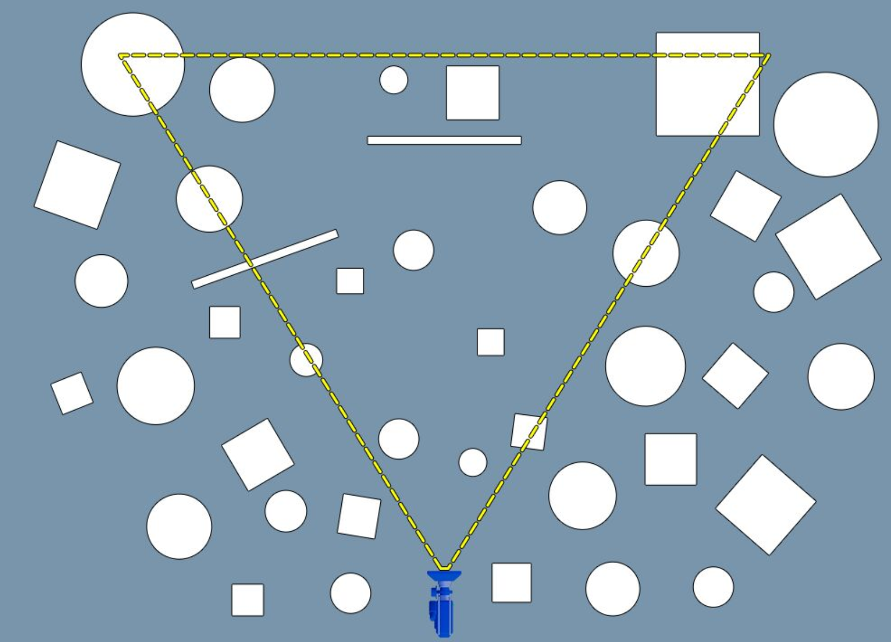
&emsp;&emsp;然后利用pvs对当前视野内的静态物体进行裁剪，pvs的优点是运行效率高，缺点是需要离线烘焙可见性信息，增加运行时内存开销，无法处理动态物体。最后利用occlusion culling进行进一步的遮挡剔除。其中oc根据实现方式可以分为hardware oc, hzb oc, software oc。hardware oc是直接利用图形API Query查询对象的可见性的遮挡剔除技术，优点是可以根据当前已有的深度信息，直接在GPU层面查询遮挡信息，但是同时也存在硬件查询的开销，以及GPU数据回读到CPU带来的延时问题，从而导致颠簸(Pop in)等现象，并且在执行效率和裁剪有效性上也存在一定的问题。hzb oc指的是利用Hierarchical Z-Buffer的遮挡剔除技术，需要Hierarchical Z-Buffer的支持，移动平台通常没有这个数据，而且hzb oc的裁剪偏保守，在裁剪有效性上存在问题。所以目前移动平台通常使用的是software oc，在CPU层面利用软光栅化技术得到场景深度信息进行政党提出。根据算法的特性，设计合适的数据结构，利用simd指令优化，可以保证实时性和裁剪有效性。详情可以参阅Masked Software Occlusion Culling一文。 
&emsp;&emsp;我们根据上面的算法，在UE引擎和移动平台，优化定制了一套software oc方案，结果示意图如下：
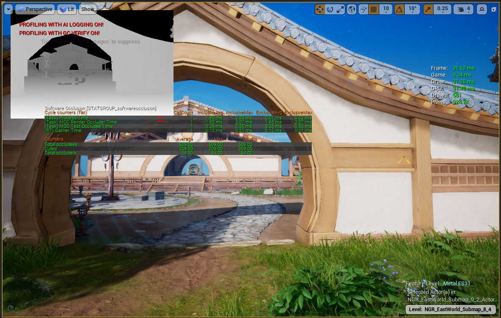

## 4.3 场景对象加载
&emsp;&emsp;场景对象的加载与卸载，也是一种复杂度控制手段，他会影响到IO、CPU和内存消耗。我们这里重点讲一下加载问题，因为不合理的加载策略，可能导致卡顿，或者显示延迟的现象。通常，我们需要确定加载什么对象以及LOD，进行异步加载的同时还需要限制每帧的加载时长。 
&emsp;&emsp;场景对象的加载，有两个重要指标：加载速度、加载的资源量。 
加载速度，影响因素包括：数据存储格式，IO速度，同步异步等。其中数据存储格式跟项目密切相关，包括压缩解压算法，资源大小，序列化速度等。 
加载的资源量，这个主要是指一次性加载的多个资源，在UE里有一个sublevel的概念，这个是作为一个整体进行加载的，为不同类型、大小、重要性的场景对象进行不同的sublevel划分方式，对于加载的优化十分重要。 

&emsp;&emsp;除了上述的性能指标，还有一个加载策略问题，即在什么时候(when)，加载哪些(what)场景对象。为了解决这个问题，我们将场景对象分为：功能类（影响玩法，比如寻路数据、触发器等）、显示类（不影响玩法，比如装饰用的杂草、石块等）、功能+显示类。另外，还有一个基本概念：热区(Area of Interseting)，即玩家感兴趣的范围。对于MMO，角色战斗范围不过几十米之内，大多数情况下，信息获取范围不足百米。而对于FPS来说，枪械有非常远的攻击距离，战斗范围可能会延伸到0.5公里左右。我们可以使用如下的加载策略： 
对于功能类对象，如果是影响全局功能，则预先加载；如果是影响局部功能，则在进入设定的影响区域后再进行加载。 
对于显示类对象，根据其对画面的贡献(屏幕占比、透明度等)，选在在合适的距离加载对应的LOD数据。 

&emsp;&emsp;另外，UE实现了的Mesh Lod Streaming和Texture Streaming机制，利用这个机制，我们可以只加载指定的[RequiredLodLevel ,MaxLodLevel]区间的Lod集合。游戏运行时，合理使用这个机制，可以有效的控制因加载引起的消耗，并且可以加快显示速度。

## 4.4 反馈控制器模块
&emsp;&emsp;反馈控制器模块，根据反馈的系统指标数据和期望的系统指标数据之间的差异，根据一定的策略发送控制指令到复杂度控制模块，从而达到调节场景复杂度的目的。 
### 4.4.1 反馈控制器流程
1、初始化。根据当前硬件平台，初始化既定目标值：targetFPS、Buckets Level、场景复杂度总量、CPU时间、GPU时间、Memory数值、Drawcall数值。 
2、计算当前视口场景复杂度，和目标复杂度比较，确定是否需要根据差值决定是否切换目标值等级？是，跳到1；否，跳到3。 
3、是否可以进行调节（上一次调节是否结束，当前环境是否允许新的调节动作）？否，等待；是，跳到4。 
4、根据当前内存使用量，和目标内存数值比较，确定当前内存是否报警？是，发送卸载对象指令；否，跳到5。 
5、根据当前GPU消耗，和目标GPU消耗进行比较，确定GPU是否过载？ 
&emsp;&emsp;是，{如果RHI线程没有过载，则发送降低LOD指令；如果RHI线程过载，则发送隐藏对象指令}； 
&emsp;&emsp;否，跳到6。 
6、根据当前RHI线程CPU消耗，和目标CPU消耗进行比较，确定RHI线程是否过载？ 
&emsp;&emsp;是，{当前DrawCall是否过高？是，发送DC调节指令（切换HLOD或者在Render线程没有过载的情况下动态合批）; 
&emsp;&emsp;否，发送隐藏对象指令}；否，发送升高LOD指令或者显示对象指令或者取消HLOD指令。 
7、根据当前Render线程CPU消耗，和目标CPU消耗进行比较，确定Render线程是否过载？ 
&emsp;&emsp;是，发送隐藏对象指令（调整植被等实例化对象的Scalability）； 
&emsp;&emsp;否，发送显示对象指令（调整植被等实例化对象的Scalability）。 
8、根据当前Game线程CPU消耗，和目标CPU消耗进行比较，确定Game线程是否过载？是，跳到9；否，发送加载对象指令，跳到9。 
9、返回2。 

### 4.4.2 反馈控制器代码
&emsp;&emsp;以下为反馈控制器的主要功能类和接口定义：
~~~
//Bottleneck类型定义
enum EPerformanceBottleneckType
{
	FPS,
	Memory,
	GPU,
	RHIThread,
	RenderThread,	
	GameThread,
};

class FPerformanceController
{
	bool CanAdjustLOD();
	bool CanAdjustHLOD();
	bool CanAdjustActor();
	bool CanAdjustLoad();

	void RaiseLOD();
	void LowerLOD();

	void AdjustHLOD();
	void TryDyanmicInstance();

	void ActiveActor();
	void DeactiveActor();

	void LoadActor();
	void UnloadActor();
};
~~~

# 5.特殊场景对象的处理
&emsp;&emsp;以上基本介绍完场景复杂度控制方案，其中关于复杂度的控制指令都是针对一般性场景对象。本节针对特殊的大世界场景对象进行单独和重点阐述。众所周知，对于大世界场景，比较典型的场景对象有大面积地形，大规模植被等。这两类对象具有屏幕占比高，实例数量多的特点，是场景复杂度的重要来源。如何处理这两类对象，直接关系到整个场景复杂度的数量级。因此，这两类对象是我们需要重点关注的内容。下面关于他们的优化处理方法，可以理解为，在使用复杂度较低的LOD和DrawCall的同时，保证了较好的渲染效果。因此，对于这些特殊对象的处理方法，可以无缝集成到我们方案中的复杂度控制模块的控制指令中。

### 2.5.1 Landscape 
#### 2.5.1.1 地形系统与地形低模代理方案 
&emsp;&emsp;UE的地形系统，采用的是Geo-Mipmap，他的优点是LOD生成简单，顶点缓冲区、索引缓冲区可以共用等。另外,UE的地形系统，渲染单位是component，并且地表渲染用的是多层layer根据weightmap texture进行混合的方案，为了减少材质复杂度和采样数，UE会为每个component生成一个独立的material instance。基于这些实现和优化，导致了相应的缺点，如component无法合批渲染，使得大地形的DrawCall很高。LOD的区分只和屏幕占比有关，使得无法区分不同地形区域对于地形mesh的细节需求，如山丘和平地有可能使用相同的LOD,要么因为高LOD造成细节丢失，要么因为低LOD造成顶点浪费等。 
&emsp;&emsp;基于上述的分析，在使用ue地形系统来构造大世界，我们选择近处使用地形系统来表现细节，远处使用地形低模代理来表现轮廓的方案。这样可以表现大世界的同时，也极大的降低了复杂度，如DrawCall,材质复杂度等。 

&emsp;&emsp;UE原生低模代理的生成,只能指定整个sublevel的网格百分比或者某个特定LOD，然而sublevel通常会包含多个component，每个component代表的地貌需要不同的LOD等级。从而导致，这种代理生成方式，不但会影响美术对于地形的迭代速度，也不能保证视觉效果。因此，我们使用基于误差的分割策略。这样既能保证平地使用较少的顶点数，同时也能保证细节较多的地方(如山丘等)保持较好的细节。
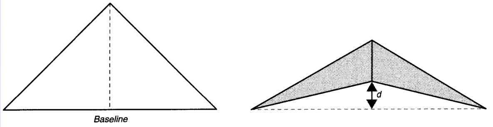

公式如下：
\[Split ?= \frac{ES}{D} > L \]
\[E = error metric \]
\[S = error scale \]
\[D = distance to viewer \]
\[L = ratio limit \]

#### 2.5.1.2 地形渲染的合批方案 
&emsp;&emsp;虽然地形低模代理方案在一定程度上缓解了DrawCall过高的问题，但同时也会增加Mesh和纹理的使用量，本质上是一种空间换时间的方法。所以根据不同硬件平台的特性，我们需要在地形和低模代理直接取一个合适的边界。所以，我们也需要考虑地形系统自身的合批方案，从而降低地形系统自身的DrawCall消耗。根据上面对于UE地形系统的分析，我们可以使用Virtual Texture,把地形渲染时需要的纹理统一通过VT来存储，因此相同LOD的地形component可以合批渲染。
&emsp;&emsp;VT是比较成熟的渲染技术，这里不过多阐述，需要注意的是要进行压缩格式的处理，比如ASTC，否则带宽消耗会比较可观，下图是VT原理示意图：
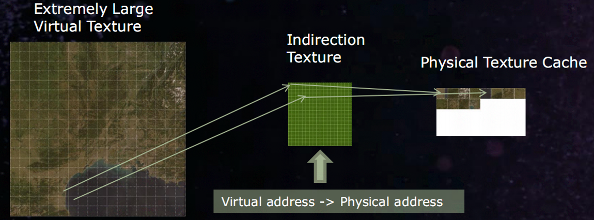

### 2.5.2 Foliage 
&emsp;&emsp;UE的植被方案采用的是HISM，内部实现采用K-D Tree来管理实例对象，相对于他的基类ISM，他能够支持分簇LOD实例进行渲染，这个特性使得它比较适合一定范围内植被对象的管理和渲染。但是当范围增大，植被实例增加，HISM导致的CPU、GPU消耗都会极具增加。常用的解决方案是增加植被static mesh的LOD区分力度，也无法很好的缓解这个问题，同时还会引起中远景的植被表现力急剧下降。 
&emsp;&emsp;下图是hism渲染示意图：
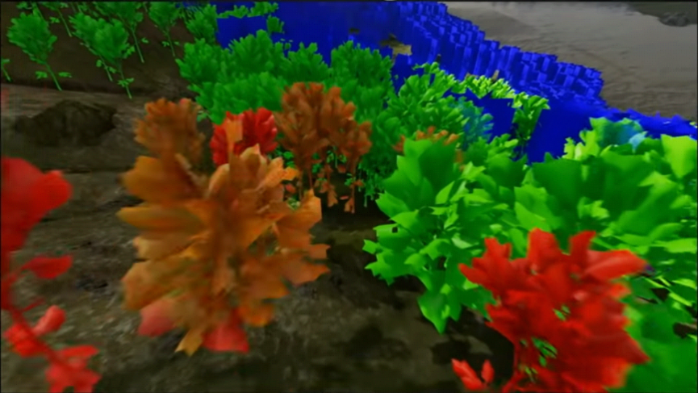
 
#### 2.5.2.1 Imposter方案 
&emsp;&emsp;一棵树通常需要几千面组成，一棵树的Impostor只有一个面片，两个三角形组成。Impostor通过对一棵树的多个方向进行拍照，然后根据相机和树的方向，显示对应的纹理图片。Imposter通常会作为一个独立的mesh LOD存在，因为只有一个LOD，所以可以使用ISM存储Imposter植被群，无论在数据结构还是对象复杂度，都比传统的HISM存储的多级LOD Mesh更高效。为了不降低Imposter的表现力，本方案采用的纹理信息和优化点如下: 
1、两张纹理：BaseColor、Normal。 
BaseColor，R、G、B通道表示BaseColor；Alpha通道：第0-6位：深度；第7位：Mask。 
Normal, R、G 通道表示Normal，B通道：AO信息；Alpha通道：第0-6位, 树木的厚度，用来做SSS处理,第7位, 表示树叶和树杆分类。 
2、增强立体感。法线进行球面处理： 
  OriNormal：捕捉拍到的法线。 
  SphereNormal: 球面法线。 
  NewNormal：处理后的法线. 
  NewNormal = lerp(OriNormal, SphereNormal, lerpParam); 
  其中lerpParam参数(0-1)，越小就越靠近原来捕捉的法线，越大就越靠近球面法线。可以通过调lerpParam参数获取想要的效果。 

3、SSS效果。烘培Impostor Normal时，多增加一个渲染pass，用来生成树木的厚度图。该厚度信息保存在Normal纹理的Alpha 通道里面。树木的厚度信息用来做SSS的处理：树木的光线透视主要通过厚度来处理，越厚则光线透视越差，相反，越薄则光线投射越强。 
  SSS = SSS * Thickness 

下图是实际的Imposter渲染效果 
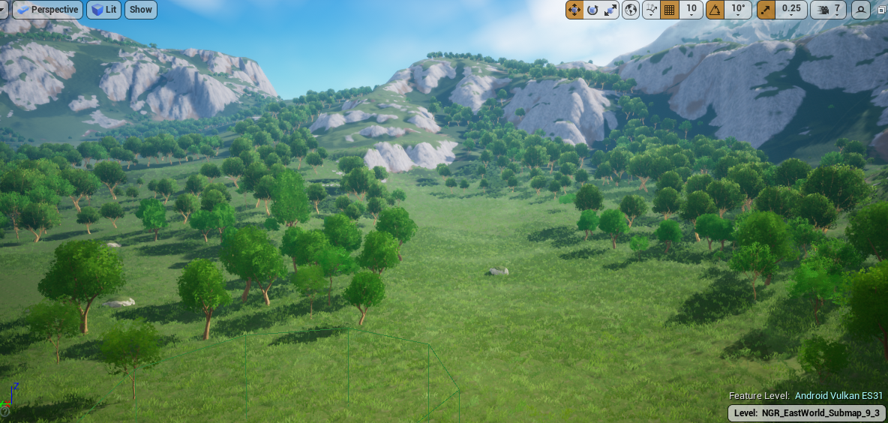
下面是Imposter用到的纹理资源 
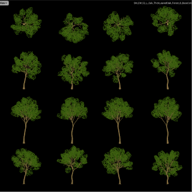
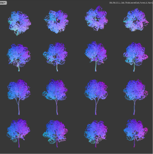
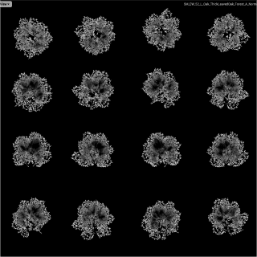

# 6.测试数据
&emsp;&emsp;下图是基于实际项目的大世界场景的测试数据，12x12公里大地形，有人工建筑区域，也有户外密集的植被区域。通过测试数据可以看出，游戏在运行过程中除了几个轻微的卡顿点之外，整个fps平滑的控制在某个设定值。这几个卡顿点主要发生在地形的sublevel加载和远处的植被区域加载。如何解决加载大块资源或者如何组织场景资源来避免卡顿问题，这是我们下一步需要优化的工作。
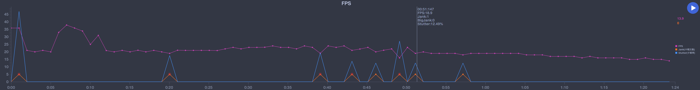

# 7.总结
&emsp;&emsp;本文分析了大世界场景的典型特征，并在介绍现代硬件平台的核心资源和渲染架构的基础上，给出了复杂度的定义。结合工业控制中的负反馈控制理论和游戏运行的目标需求，提出了大世界的场景复杂度控制方案，主要原理是根据反馈的系统指标数据和期望的系统指标数据之间的差异，以及预先制定的控制策略，生成相应的控制指令，最终达到智能控制场景对象的加载卸载、显示隐藏、LOD控制的目标以及平滑的游戏运行体验。 
&emsp;&emsp;读者可在此基础上，根据项目的需求以及发布平台，合理定制系统指标模块、预处理模块、反馈控制器模块和复杂度控制模块。

# 参考文献
Adaptive Virtual Texture Rendering in Far Cry 4 
Terrain in Battlefield 3: A modern, complete and scalable system 
Fast Terrain Rendering Using Geometrical MipMapping 
Real Time 3D Terrain Engines Using C++ And Dx9 
Masked Software Occlusion Culling 
UE4制作多人大地型游戏的优化 
UE高级性能剖析技术 
Vulkan高性能渲染 